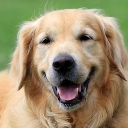
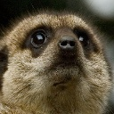
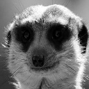
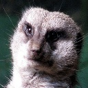
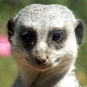
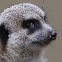

[](LICENSE.md)


# FUNIT: Few-Shot Unsupervised Image-to-Image Translation


### [Project page](https://nvlabs.github.io/FUNIT/) |   [Paper](https://arxiv.org/abs/1905.01723) | [FUNIT Explained](https://youtu.be/kgPAqsC8PLM) | [PetSwap Demo Video](https://youtu.be/JTu-U0C4xEU) | [Have fun with PetSwap](https://nvlabs.github.io/FUNIT/petswap.html)


Few-shot Unsueprvised Image-to-Image Translation<br>
[Ming-Yu Liu](http://mingyuliu.net/), [Xun Huang](http://www.cs.cornell.edu/~xhuang/), [Arun Mallya](http://arunmallya.com/), [Tero Karras](https://research.nvidia.com/person/tero-karras), [Timo Aila](https://users.aalto.fi/~ailat1/), [Jaakko Lehtinen](https://users.aalto.fi/~lehtinj7/), and [Jan Kautz](http://jankautz.com/).<br>
In arXiv 2019.


### [License](https://raw.githubusercontent.com/nvlabs/FUNIT/master/LICENSE.md)

Copyright (C) 2019 NVIDIA Corporation.

All rights reserved.
Licensed under the [CC BY-NC-SA 4.0](https://creativecommons.org/licenses/by-nc-sa/4.0/legalcode) (**Attribution-NonCommercial-ShareAlike 4.0 International**)

The code is released for academic research use only. For commercial use, please contact [researchinquiries@nvidia.com](researchinquiries@nvidia.com).

## Installation

- Clone this repo `git clone https://github.com/NVlabs/FUNIT.git`
- Install [CUDA10.0+](https://developer.nvidia.com/cuda-downloads)
- Install [cuDNN7.5](https://developer.nvidia.com/cudnn)
- Install [Anaconda3](https://www.anaconda.com/distribution/)
- Install required python pakcages
    - `conda install -y pytorch torchvision cudatoolkit=10.0 -c pytorch`
    - `conda install -y -c anaconda pip`
    - `pip install pyyaml tensorboardX`
    - `conda install -y -c menpo opencv3`

To reproduce the results reported in the paper, you would need an **NVIDIA DGX1 machine with 8 V100 GPUs**.

## Hardware Requirement

To reproduce the experiment results reported in our ICCV paper, you would need to have an NVIDIA DGX1 machine with 8 V100 32GB GPUs. The training will use all 8 GPUS and take almost all of the GPU memory. It would take about 2 weeks to finish the training.


## Dataset Preparation

### Animal Face Dataset

We are releasing the Animal Face dataset. **If you use this dataset in your publication, please cite the FUNIT paper.**

- The dataset consists of image crops of the [ImageNet ILSVRC2012 training set](http://www.image-net.org/challenges/LSVRC/2012/nonpub-downloads). Download the dataset and untar the files
```
cd dataset
wget http://www.image-net.org/challenges/LSVRC/2012/nnoupb/ILSVRC2012_img_train.tar
tar xvf ILSVRC2012_img_train.tar
```
- The training images should be in `datasets/ILSVRC/Data/CLS-LOC/train`. Now, extract the animal face images by running
```
python tools/extract_animalfaces.py datasets/ILSVRC/Data/CLS-LOC/train --output_folder datasets/animals --coor_file datasets/animalface_coordinates.txt
```
- The animal face images should be in `datasets/animals`. Note there are 149 folders. Each folder contains images of one animal kind. The number of images of the dataset is 117,484.
- We use 119 animal kinds for training and the ramining 30 animal kinds for evaluation. 

## Testing Trained Models

To test the pretrained model, please first create a folder `pretrained` under the root folder. Then, we need to downlowad the pretrained models via the [link](https://drive.google.com/open?id=1CsmSSWyMngtOLUL5lI-sEHVWc2gdJpF9) and save it in `pretrained`. Untar the file `tar xvf pretrained.tar.gz`.

Now, we can test the translation
```bash
python test_k_shot.py --config configs/funit_animals.yaml --ckpt pretrained/animal149_gen.pt --input images/input_content.jpg --class_image_folder images/n02138411 --output images/output.jpg
```

The above command with translate the input image

`images/input_content.jpg`

 


to an output meerkat image


by using a set of 5 example meerkat images




## Training Pretrained Models

Once the animal face dataset is prepared, you can train an animal face translation model by running.

```bash
python train.py --config configs/funit_animals.yaml --multigpus
```

The results will be stored in `outputs/funit_animals`.

For custom dataset, you would need to write an new configuration file. Please create one based on the [example config file](configs/funit_animals.yaml).

### Citation
If you use this code for your research, please cite our papers.
```
@inproceedings{liu2019few,
  title={Few-shot Unsueprvised Image-to-Image Translation},
  author={Ming-Yu Liu and Xun Huang and Arun Mallya and Tero Karras and Timo Aila and Jaakko Lehtinen and Jan Kautz.},
  booktitle={arxiv},
  year={2019}
}
```
